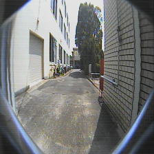
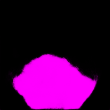

This is my attempt to implement a semantic segmentation network on darknet framework.

I implement a modified version of U-Net (https://arxiv.org/abs/1505.04597) to detect road surface.

Input to model: 224 x 224 x 3 images

Output: 224 x 224 binary label

I added a bunch of code to the darknet source files for data pre processing.

I recommend using cscope to browse through the code, makes life easier!

Sample data to train and test can be found in data/unet folder.

Feel free to adapt the code to your needs.

Cheers!

Sample:

